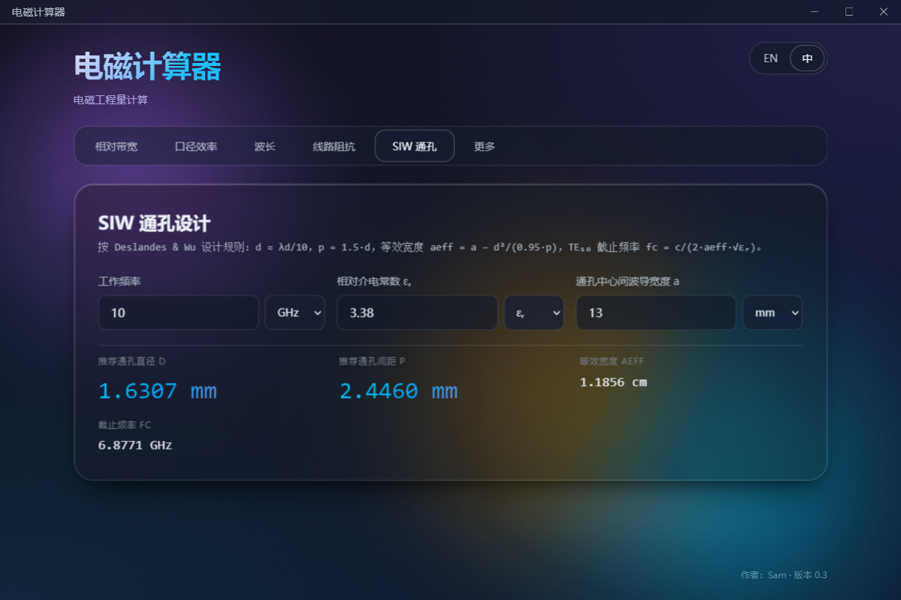

# EM Calculator

Electron desktop application that calculates common electromagnetic engineering quantities — **relative bandwidth**, **aperture efficiency**, **wavelength**, **transmission line impedance** (microstrip / CPW / GCPW / coaxial), and **SIW via design** — with bilingual UI (English / 中文) and a stunning **Apple Liquid Glass** inspired interface. Ships as a portable executable; no installer, no user data stored.


## ✨ Features

### 🧮 Calculations
- **Relative bandwidth**: enter `fmin` and `fmax` (with selectable Hz/kHz/MHz/GHz units); the app reports absolute bandwidth, center frequency, and the standard fractional bandwidth `(fmax − fmin) / fcenter`.
- **Aperture efficiency**: enter frequency, antenna gain in dBi, and physical aperture area (m² or cm²); the app reports wavelength λ, effective aperture area Aₑ, and efficiency η, flagging over-unity inputs as physically inconsistent.
- **Wavelength** *(new in v0.3.0)*: enter frequency and relative permittivity εᵣ; the app reports free-space wavelength λ₀, guided wavelength λg = λ₀/√εᵣ (TEM), λg/2, λg/4, and phase velocity.
- **Transmission line impedance** *(new in v0.3.0)*: characteristic impedance Z₀, effective permittivity εeff, and phase velocity for four line types — **microstrip** (Hammerstad–Jensen), **CPW** and **GCPW** (Ghione–Naldi conformal mapping with an AGM-based elliptic integral), and **coaxial** (`Z₀ = 60/√εᵣ · ln(D/d)`). Lengths accept mm / µm / mil.
- **SIW via design** *(new in v0.3.0)*: enter operating frequency, εᵣ, and via center-to-center width `a`; the app recommends via diameter `d ≈ λd/10` and pitch `p = 1.5·d` (Deslandes & Wu rules), and reports the equivalent width `aeff = a − d²/(0.95·p)` and TE₁₀ cutoff frequency, warning when the design is below cutoff.

### 🎨 Design (v0.2.0)
- **Apple Liquid Glass UI** — Inspired by Apple's 2026 design language with real-time backdrop blur, dynamic transparency (65-75%), and enhanced color saturation
- **Frameless Window** — Custom title bar with window controls (minimize, maximize/restore, close), draggable region, and double-click to maximize
- **Dynamic Animated Background** — Flowing gradient blobs with smooth 20-25s animation cycles and subtle rotation effects
- **Responsive Layout** — Fluid scaling from 720×540 to 1600×900 with CSS `clamp()` functions
- **Microsoft YaHei Font** — Optimized for Chinese, Japanese, and Korean character rendering

### 🌐 Bilingual UI
Switch between English and 中文 via the in-app toggle or OS menu. The active language persists across sessions.

### 🔬 Python Verification (Dev Only)
Each calculation tab exposes a "Verify with Python" button in development mode. The renderer spawns the Python implementation over IPC and reports the absolute delta against the in-process TypeScript result. Packaged builds drop Python entirely to keep the binary small.

### ♿ Accessibility
Full keyboard navigation, ARIA roles, `prefers-reduced-motion` and `prefers-reduced-transparency` fallbacks.

## 📸 Screenshots

### Main Interface - Bandwidth Calculator


### Aperture Efficiency Calculator


### Wavelength Calculator (v0.3.0)


### Transmission Line Impedance (v0.3.0)


### SIW Via Design (v0.3.0)


### Liquid Glass Dynamic Background


---

## Tech stack

- Electron 33 with `contextIsolation: true`, `sandbox: true`, `nodeIntegration: false`, and a strict CSP meta in the renderer HTML.
- electron-vite + Vite 6 + TypeScript + React 18.
- Glassmorphism layered surfaces (animated gradient blobs, SVG turbulence grain, real backdrop-filter cards).
- Vitest for renderer/lib tests; pytest for Python tests; shared `fixtures.json` ensures both implementations agree to within machine precision.

## Project layout

```
src/
├── main/                 # Electron main process: BrowserWindow, IPC, menu, Python subprocess wrapper
├── preload/              # contextBridge surface exposed as window.emApi
├── shared/               # IPC payload types shared between preload and renderer
└── renderer/             # React UI
    ├── components/       # Reusable UI parts (Tabs, GlassCard, NumberInput, ...)
    ├── features/         # bandwidth/, aperture-efficiency/, wavelength/, transmission-line/, siw/, tbd/
    ├── lib/              # Pure calculation functions, formatting, unit conversion
    ├── i18n/             # Custom Context-based translation provider
    └── styles/           # Design tokens + glass system
python/
├── em_calc.py            # CLI: actions = bandwidth | aperture-efficiency
└── tests/                # pytest, consumes the same fixtures.json as Vitest
build/
└── afterPack.cjs         # Strips unused Chromium locales during packaging
```

## 📥 Download & Installation

### Latest Release: [v0.2.0](https://github.com/SamDu1998/EM_Calculator/releases/latest)

| Platform | File | Size | Instructions |
|----------|------|------|--------------|
| **Windows** | `EM-Calculator-0.2.0-portable-x64.exe` | ~65 MB | Double-click to run. Self-extracts to `%TEMP%` and cleans up on close. |
| **Windows** | `EM-Calculator-0.2.0-x64.zip` | ~98 MB | Extract and run `EM Calculator.exe` |
| **Linux** | `EM-Calculator-0.2.0-x64.tar.gz` | ~90 MB | Extract and run `./EM-Calculator` |

**No installation required!** The portable `.exe` uses LZMA compression for the smallest single-file footprint. A custom `afterPack` hook strips ~40 MB of unused Chromium locale files (keeping only `en-*` and `zh-*`).

**No user data is stored.** Calculations are stateless — closing the app leaves nothing behind besides the OS-managed Chromium cache.

---

## 🛠️ Development

## Getting started

Prerequisites: Node 20+ and (for development) Python 3.10+.

```sh
npm install
npm run dev            # Launches Electron pointing at the Vite dev server
```

### Useful scripts

| Script | Purpose |
|---|---|
| `npm run dev` | Hot-reloading dev mode (Electron + Vite) |
| `npm run build` | Production bundle into `out/` (no installer) |
| `npm run dist:win` | Windows portable `.exe` + `.zip` into `release/` |
| `npm run dist:linux` | Linux `.tar.gz` into `release/` |
| `npm test` | Vitest unit tests with v8 coverage |
| `npm run lint` | ESLint flat config across `src/` |
| `npm run typecheck` | Composite tsc check for both node and web tsconfigs |
| `python -m pytest python/` | Run the Python reference test suite (dev only) |

## Distribution

The app ships **without an installer** — pick whichever shape suits you:

| Artifact | Size | How to run |
|---|---|---|
| `EM Calculator-<v>-portable-x64.exe` | ~65 MB | Double-click. Self-extracts to `%TEMP%` and cleans up on close. |
| `EM Calculator-<v>-x64.zip` | ~98 MB | Unzip, run `EM Calculator.exe` from the extracted folder. |
| `EM Calculator-<v>-x64.tar.gz` | ~90 MB | Extract, run `./em-calculator` from the extracted folder. |

The portable `.exe` uses LZMA compression for the smallest single-file footprint. A custom `afterPack` hook in `build/afterPack.cjs` strips ~40 MB of unused Chromium locale files (keeping only `en-*` and `zh-*`), so the packaged app starts at ~75 MB on disk rather than the default ~115 MB.

**Linux AppImage** is supported by electron-builder but requires running the build on Linux (or via Docker / WSL with a real distribution) because the `mksquashfs` tool is Linux-only. The Windows host falls back to `.tar.gz`.

**No user data is stored.** Calculations are stateless — closing the app leaves nothing behind besides the OS-managed Chromium cache. The portable build keeps that cache in `%TEMP%` and discards it on exit.

## Calculation details

Relative bandwidth uses the engineering convention `(fmax − fmin) / fcenter × 100%` where `fcenter = (fmax + fmin) / 2`.

Aperture efficiency follows `η = Aₑ / Aphys` where `Aₑ = (λ² / 4π) · 10^(G/10)` and `λ = c / f` with `c = 299_792_458 m/s`.

When the computed efficiency exceeds 100% the UI surfaces a warning, since this implies the supplied gain or physical area is physically inconsistent rather than the calculator being wrong.

### v0.3.0 calculator models

- **Wavelength**: `λ₀ = c/f`, `λg = λ₀/√εᵣ` for a TEM wave in a uniform dielectric, phase velocity `vₚ = c/√εᵣ`.
- **Microstrip**: Hammerstad–Jensen closed-form model (1980), zero conductor thickness. The UI warns when `W/h` leaves the validated `0.01 – 100` range. Verified against the classic 50 Ω FR4 design (`W = 3.06 mm, h = 1.6 mm, εᵣ = 4.4`) and the textbook 126.5 Ω air line at `W/h = 1`.
- **CPW / GCPW**: conformal-mapping formulas (Ghione–Naldi 1987 / Simons) using the complete elliptic integral of the first kind, computed with the AGM iteration to ~1e-15. The implementation reproduces the analytic thick-substrate limit `εeff → (εᵣ+1)/2` exactly.
- **Coaxial**: TEM `Z₀ = 60/√εᵣ · ln(D/d)`, verified against RG-405 (50 Ω) and RG-6-class (75 Ω) cable geometries.
- **SIW**: Deslandes & Wu (2001) — `aeff = a − d²/(0.95·p)`, `fc = c/(2·aeff·√εᵣ)`, with the conservative via rules `d ≈ λd/10`, `p = 1.5·d` (inside the typical `1.5d – 2d` window).

## 🚀 Roadmap

- [x] **Apple Liquid Glass Design** — Completed in v0.2.0
- [x] **Frameless Window** — Completed in v0.2.0
- [x] **Responsive Layout** — Completed in v0.2.0
- [x] **GitHub Actions CI/CD** — Automated release pipeline
- [x] **Wavelength, transmission line, and SIW calculators** — Completed in v0.3.0
- [ ] SVG cross-section visualizations for the transmission line and SIW tabs
- [ ] **Linux AppImage** packaging via Docker or Linux host
- [ ] Playwright E2E tests for tab switch, language switch, and Python verification
- [ ] Additional calculators in the "More" tab (Friis path loss, antenna radiation pattern, impedance matching)

## 📄 License

MIT
